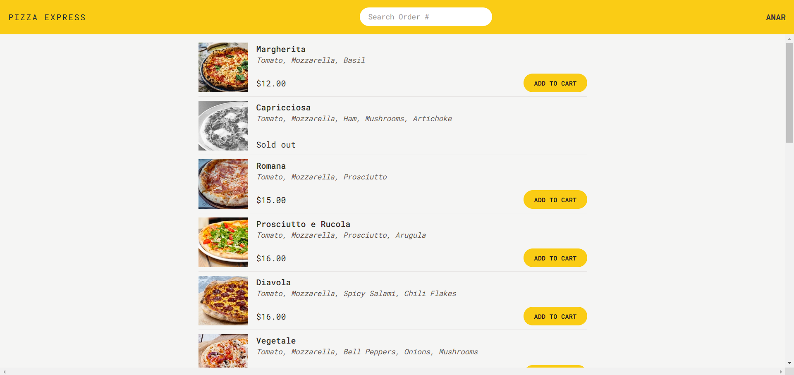

# Pizza Express

Pizza Express is a React project where people can order pizza without authentication.

You can view the project live here:
[Pizza-Express](https://pizza-express-react-app.netlify.app/)

### Table of Contents

- [Project-requirements-from-the-business](#project-requirements-from-the-business)
- [Technologies](#getting-started)
- [References](#references)

## Project requirements from the business

- Very simple application, where users can order one or more pizzas from a menu
- Requires no user accounts and no login: users just input their names before using the app
- The pizza menu can change, so it should be loaded from an API
- Users can add multiple pizzas to a cart before ordering
- Ordering requires just the user’s name, phone number, and address
- User’s can mark their order as “priority” for an additional 20% of the cart price
- Orders are made by sending a POST request with the order data (user data + selected pizzas) to the API
- Payments are made on delivery, so no payment processing is necessary in the app
- Each order will get a unique ID that should be displayed, so the user can later look up their order based on the ID

## Technologies

- 👉 Routing - React Router
- 👉 Styling - Tailwindcss
- 👉 Remote state management - React Query
- 👉 Ui state management - Redux

## References

I made this project with the help of Jonas Schmedtmann in the React course: [React course](https://www.udemy.com/course/the-ultimate-react-course/)
